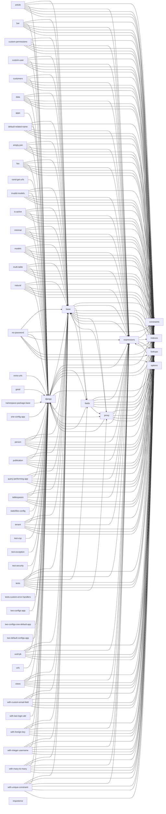

# Domain dependency graph

> Auto-generated from codebase scan. Do not edit manually.

```mermaid
graph LR
    apps --> django
    article --> base
    article --> constraints
    article --> django
    article --> expressions
    article --> indexes
    article --> lookups
    article --> options
    bar --> base
    bar --> constraints
    bar --> django
    bar --> expressions
    bar --> indexes
    bar --> lookups
    bar --> options
    base --> constraints
    base --> django
    base --> expressions
    base --> fields
    base --> indexes
    base --> lookups
    base --> options
    base --> proxy
    cond-get-urls --> django
    custom-permissions --> base
    custom-permissions --> constraints
    custom-permissions --> django
    custom-permissions --> expressions
    custom-permissions --> indexes
    custom-permissions --> lookups
    custom-permissions --> options
    custom-user --> base
    custom-user --> constraints
    custom-user --> django
    custom-user --> expressions
    custom-user --> indexes
    custom-user --> lookups
    custom-user --> options
    customers --> base
    customers --> constraints
    customers --> django
    customers --> expressions
    customers --> indexes
    customers --> lookups
    customers --> options
    data --> base
    data --> constraints
    data --> django
    data --> expressions
    data --> indexes
    data --> lookups
    data --> options
    default-related-name --> base
    default-related-name --> constraints
    default-related-name --> django
    default-related-name --> expressions
    default-related-name --> indexes
    default-related-name --> lookups
    default-related-name --> options
    django --> base
    django --> constraints
    django --> expressions
    django --> fields
    django --> indexes
    django --> lookups
    django --> options
    django --> proxy
    empty-join --> base
    empty-join --> constraints
    empty-join --> django
    empty-join --> expressions
    empty-join --> indexes
    empty-join --> lookups
    empty-join --> options
    expressions --> base
    expressions --> constraints
    expressions --> django
    expressions --> indexes
    expressions --> lookups
    expressions --> options
    extra-urls --> django
    fields --> base
    fields --> constraints
    fields --> django
    fields --> expressions
    fields --> indexes
    fields --> lookups
    fields --> options
    fields --> proxy
    foo --> base
    foo --> constraints
    foo --> django
    foo --> expressions
    foo --> indexes
    foo --> lookups
    foo --> options
    good --> django
    indexes --> base
    indexes --> django
    indexes --> expressions
    invalid-models --> base
    invalid-models --> constraints
    invalid-models --> django
    invalid-models --> expressions
    invalid-models --> indexes
    invalid-models --> lookups
    invalid-models --> options
    is-active --> base
    is-active --> constraints
    is-active --> django
    is-active --> expressions
    is-active --> indexes
    is-active --> lookups
    is-active --> options
    minimal --> base
    minimal --> constraints
    minimal --> django
    minimal --> expressions
    minimal --> indexes
    minimal --> lookups
    minimal --> options
    models --> base
    models --> constraints
    models --> django
    models --> expressions
    models --> indexes
    models --> lookups
    models --> options
    multi-table --> base
    multi-table --> constraints
    multi-table --> django
    multi-table --> expressions
    multi-table --> indexes
    multi-table --> lookups
    multi-table --> options
    namespace-package-base --> django
    natural --> base
    natural --> constraints
    natural --> django
    natural --> expressions
    natural --> indexes
    natural --> lookups
    natural --> options
    no-password --> base
    no-password --> constraints
    no-password --> django
    no-password --> expressions
    no-password --> indexes
    no-password --> lookups
    no-password --> options
    one-config-app --> django
    person --> base
    person --> constraints
    person --> django
    person --> expressions
    person --> indexes
    person --> lookups
    person --> options
    proxy --> base
    proxy --> constraints
    proxy --> django
    proxy --> expressions
    proxy --> indexes
    proxy --> lookups
    proxy --> options
    publication --> base
    publication --> constraints
    publication --> django
    publication --> expressions
    publication --> indexes
    publication --> lookups
    publication --> options
    query-performing-app --> base
    query-performing-app --> constraints
    query-performing-app --> django
    query-performing-app --> expressions
    query-performing-app --> indexes
    query-performing-app --> lookups
    query-performing-app --> options
    staticfiles-config --> django
    tablespaces --> base
    tablespaces --> constraints
    tablespaces --> django
    tablespaces --> expressions
    tablespaces --> indexes
    tablespaces --> lookups
    tablespaces --> options
    tenant --> base
    tenant --> constraints
    tenant --> django
    tenant --> expressions
    tenant --> indexes
    tenant --> lookups
    tenant --> options
    test-csp --> django
    test-exception --> django
    test-security --> django
    tests --> base
    tests --> constraints
    tests --> django
    tests --> expressions
    tests --> fields
    tests --> indexes
    tests --> lookups
    tests --> options
    tests --> proxy
    tests-custom-error-handlers --> django
    two-configs-app --> django
    two-configs-one-default-app --> django
    two-default-configs-app --> django
    urls --> django
    uuid-pk --> base
    uuid-pk --> constraints
    uuid-pk --> django
    uuid-pk --> expressions
    uuid-pk --> indexes
    uuid-pk --> lookups
    uuid-pk --> options
    views --> base
    views --> constraints
    views --> django
    views --> expressions
    views --> indexes
    views --> lookups
    views --> options
    with-custom-email-field --> base
    with-custom-email-field --> constraints
    with-custom-email-field --> django
    with-custom-email-field --> expressions
    with-custom-email-field --> indexes
    with-custom-email-field --> lookups
    with-custom-email-field --> options
    with-foreign-key --> base
    with-foreign-key --> constraints
    with-foreign-key --> django
    with-foreign-key --> expressions
    with-foreign-key --> indexes
    with-foreign-key --> lookups
    with-foreign-key --> options
    with-integer-username --> base
    with-integer-username --> constraints
    with-integer-username --> django
    with-integer-username --> expressions
    with-integer-username --> indexes
    with-integer-username --> lookups
    with-integer-username --> options
    with-last-login-attr --> django
    with-many-to-many --> base
    with-many-to-many --> constraints
    with-many-to-many --> django
    with-many-to-many --> expressions
    with-many-to-many --> indexes
    with-many-to-many --> lookups
    with-many-to-many --> options
    with-unique-constraint --> base
    with-unique-constraint --> constraints
    with-unique-constraint --> django
    with-unique-constraint --> expressions
    with-unique-constraint --> indexes
    with-unique-constraint --> lookups
    with-unique-constraint --> options
    importerror
```
